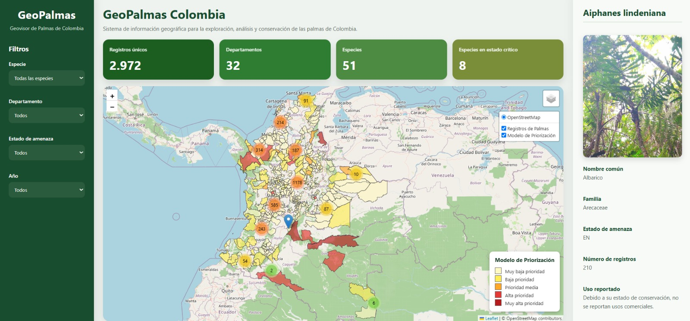

# Identificación de municipios prioritarios para la conservación de palmas amenazadas mediante inteligencia artificial y datos abiertos en Colombia

<p align="center">
  
</p>

<p align="center">

# 🌍 Geovisor interactivo

Los resultados del proyecto pueden explorarse mediante un geovisor web desarrollado con tecnologías abiertas y publicado utilizando **GitHub Pages**.

🔗 **Acceder al geovisor:**

https://sarabaquerom.github.io/GeoPalmas---Oficial/

El geovisor permite visualizar:

- Riesgo municipal de generación de alertas de deforestación para 2026.
- Municipios con registros de palmas amenazadas.
- Variables utilizadas por el modelo de inteligencia artificial.
- Información descriptiva por municipio.

**Concurso Datos al Ecosistema 2026**

Proyecto desarrollado utilizando datos abiertos, análisis espacial e inteligencia artificial para apoyar la conservación de la biodiversidad en Colombia.

</p>

---

# Descripción

Este proyecto integra información abierta sobre biodiversidad y monitoreo ambiental para identificar municipios con mayor riesgo de generación de alertas de deforestación y analizar su relación con la presencia de palmas amenazadas en Colombia.

Para ello se combinaron registros de ocurrencia de especies obtenidos desde GBIF, el listado oficial de especies amenazadas de Colombia, las Alertas Tempranas de Deforestación del IDEAM correspondientes al periodo 2017–2025 y variables territoriales derivadas mediante análisis espacial.

A partir de esta información se desarrolló un modelo de aprendizaje automático basado en Random Forest que permitió estimar el riesgo municipal de generación de alertas para 2026.

---

# Objetivo

Desarrollar un flujo de trabajo reproducible que integre datos abiertos de biodiversidad y monitoreo forestal mediante técnicas de inteligencia artificial para apoyar la priorización territorial de acciones de conservación.

---

# Fuentes de datos

El proyecto integra información proveniente de fuentes oficiales y de acceso abierto:

- Listado oficial de especies silvestres amenazadas de Colombia (Resolución 0126 de 2024).
- Registros de ocurrencia de especies obtenidos desde GBIF.
- Fotografías descargadas automáticamente desde iNaturalist.
- Alertas Tempranas de Deforestación del IDEAM (2017–2025).
- Límites administrativos municipales de Colombia.

---

# Metodología

El desarrollo siguió un flujo de trabajo basado en CRISP-ML:

1. Comprensión del problema.
2. Recolección e integración de datos.
3. Limpieza y preparación de información.
4. Ingeniería de variables espaciales.
5. Entrenamiento de un modelo Random Forest.
6. Evaluación del modelo.
7. Generación de productos cartográficos.
8. Publicación de un geovisor mediante GitHub Pages.

---

# Tecnologías utilizadas

- Python
- Pandas
- GeoPandas
- Scikit-learn
- Matplotlib
- QGIS
- Git
- GitHub
- GitHub Pages

---

# Productos generados

El proyecto genera los siguientes productos:

- Dataset consolidado para aprendizaje automático.
- Variables espaciales por municipio.
- Predicción municipal de riesgo de alertas para 2026.
- Modelo Random Forest entrenado.
- Capa geográfica en formato GeoPackage.
- Geovisor web interactivo.
- Documentación técnica completamente reproducible.

---

# Geovisor

El geovisor interactivo permite explorar:

- municipios con mayor riesgo de generación de alertas;
- registros de palmas amenazadas;
- información descriptiva por municipio;
- resultados del modelo de inteligencia artificial.

**Geovisor:**

*(Agregar aquí la URL de GitHub Pages una vez publicado.)*

---

# Estructura del repositorio

```
docs/
RECURSOS/
Scripts/
Output_analisis/
README.md
requirements.txt
environment.yml
LICENSE
```

La documentación técnica completa del proyecto se encuentra disponible en la carpeta **docs/**.

---

# Reproducibilidad

Todos los análisis fueron desarrollados utilizando herramientas de código abierto.

Las dependencias necesarias para reproducir el proyecto se encuentran en:

- requirements.txt
- environment.yml

La guía completa de ejecución puede consultarse en:

```
docs/validacion_guide.md
```

---

# Licencia

Este proyecto se distribuye bajo la licencia incluida en el archivo **LICENSE**.

---

# Autores

Proyecto desarrollado para el **Concurso Datos al Ecosistema 2026**.

**Equipo:**

- Santiago Baquero
- Sara Yineth Baquero

---

# Agradecimientos

Se agradece a las entidades que ponen a disposición información abierta para investigación y conservación de la biodiversidad en Colombia, especialmente:

- Ministerio de Ambiente y Desarrollo Sostenible.
- IDEAM.
- GBIF.
- iNaturalist.
- Datos.gov.co.

